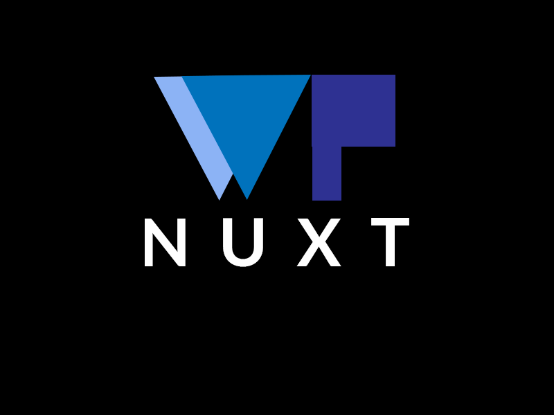

# WP NUXT &middot; [ 
> A productive union between [Nuxt.js](https://nuxtjs.org/) and [WP REST API](https://v2.wp-api.org/) to build websites.

This is a project under construction.

## Licensing

State what the license is and how to find the text version of the license.
